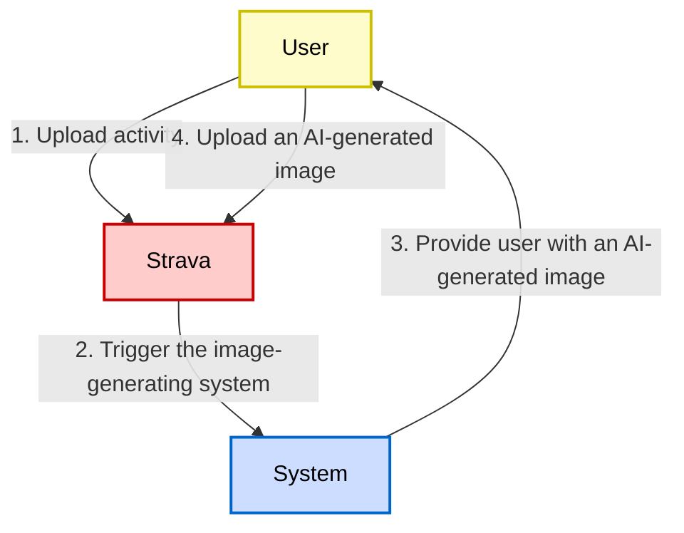
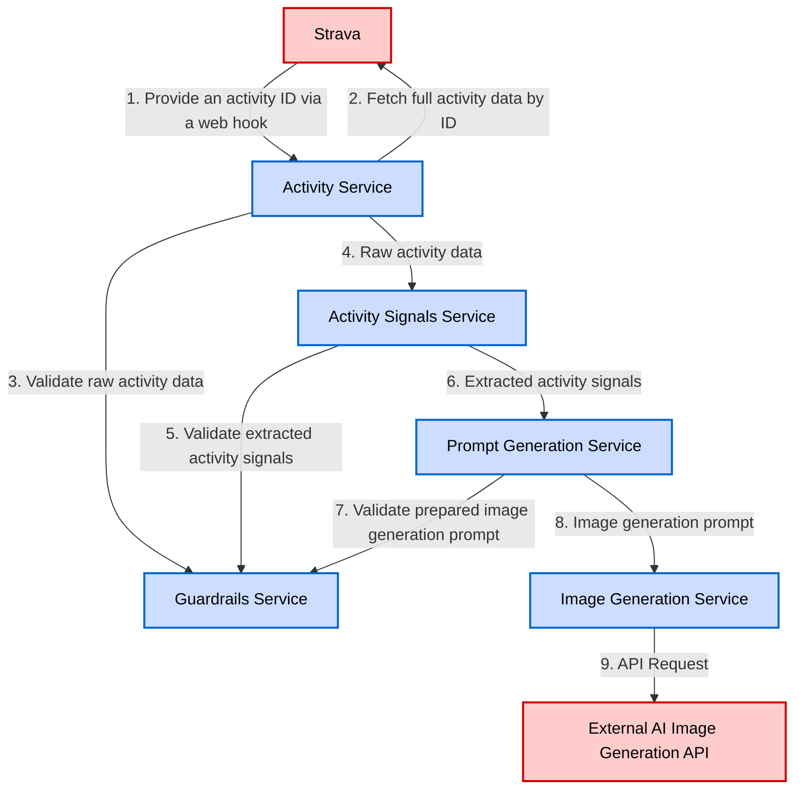

# Project Context

## Purpose
PACE (Personal Activity Canvas Engine) is an AI-powered Strava activity image generator that automatically transforms workout data into visually compelling, shareable images. The system analyzes Strava activity data and context to create personalized, expressive visuals for each activity, helping athletes present their performance and stories in a more engaging way.

### Key Goals
- Automatically generate AI images from Strava activity data
- Create safe, appropriate, and visually appealing content
- Provide athletes with shareable, personalized workout visuals
- Maintain strict content guardrails and safety measures

## Tech Stack
- **Runtime**: Bun (v1.3.6+) - Primary JavaScript/TypeScript runtime
- **Language**: TypeScript (v5.9.3) with strict mode enabled
- **Node Version**: 24.x (for compatibility when needed)
- **Package Manager**: Bun workspaces for monorepo structure
- **Testing**: Bun test (preferred over Jest)
- **Specification System**: OpenSpec (v0.20.0) for formal specifications
- **Build System**: Bun's built-in bundler
- **Module System**: ESNext modules (type: "module")

## Project Conventions

### Code Style
- **TypeScript Configuration**:
  - Target: ES2022
  - Module: ESNext with bundler resolution
  - Strict mode enabled with `noImplicitAny`
  - Bun types included
- **Naming Conventions**:
  - Services: PascalCase with "Service" suffix (e.g., `GuardrailsService`)
  - Interfaces: PascalCase, matching service names
  - Files: kebab-case for specs, lowercase for configs
- **Import Style**: ES modules with explicit extensions where needed
- **Async/Await**: Preferred over callbacks and raw promises

### Architectual Patterns
- **Service-Oriented Architecture**: Modular services with clear boundaries
- **Dependency Injection**: Explicit dependencies injected into services
- **Single Responsibility Principle**: Each module has one clear purpose
- **Interface-First Design**: Well-defined TypeScript interfaces for all services
- **Specification-Driven Development**: Formal specs guide implementation
- **Guardrails Pattern**: Centralized validation service for all content safety

### Testing Strategy
- **Test Runner**: Bun test (not Jest, despite jest.config.js presence)
- **Coverage Requirements**: 
  - Minimum 80% coverage for all metrics (branches, functions, lines, statements)
  - 100% coverage for critical paths
- **Test Types**:
  - Unit tests for each service in isolation
  - Integration tests for service interactions
  - End-to-end tests for complete flows
- **Test Location**: Tests alongside source files or in `__tests__` directories
- **Mocking**: Dependency injection for easy mocking

### Git Workflow
- **Repository**: GitHub (github.com/mrbalov/pace)
- **Branch Strategy**: Feature branches with descriptive names
- **Commit Conventions**: Clear, descriptive commit messages
- **Code Review**: Required before merging to main
- **CI/CD**: GitHub Actions for automated testing and validation

### Bun-Specific Conventions
- Use `bun` instead of `node` for running files
- Use `bun test` instead of `jest` or `vitest`
- Use `bun install` instead of npm/yarn/pnpm
- Use `bun run <script>` for package.json scripts
- Use `bunx` instead of `npx`
- Leverage Bun's built-in APIs (Bun.serve, Bun.file, etc.)
- Automatic .env loading (no dotenv needed)

## Domain Context

### Strava Integration
- **Webhook-based**: System triggered by Strava webhooks for new activities
- **Activity Data**: Fetches complete activity details via Strava API
- **Authentication**: OAuth2 for Strava API access

### AI Image Generation
- **Prompt-Based**: Converts activity data to text prompts
- **External API**: Uses third-party AI image generation services
- **Style Variety**: Supports multiple artistic styles and moods
- **Safety First**: All prompts validated through guardrails

### Service Components
1. **Guardrails Service**: Content validation and safety enforcement
2. **Activity Service**: Strava API integration and data retrieval
3. **Activity Signals Service**: Semantic signal extraction from activity data
4. **Prompt Generation Service**: AI prompt creation from signals
5. **Image Generation Service**: AI image generation management

## Important Constraints

### Safety & Content
- **Strict Guardrails**: All content must pass safety validation
- **No PII**: No personal identifiable information in generated content
- **Family-Friendly**: All generated images must be appropriate for all audiences
- **Fallback Mechanisms**: Safe defaults for any validation failures

### Technical Constraints
- **Stateless Services**: All services designed for horizontal scaling
- **Rate Limiting**: Respect API rate limits for Strava and AI services
- **Error Resilience**: Failures in one module shouldn't cascade
- **Performance**: Quick response times for webhook processing

### Compliance Requirements
- **Specification Compliance**: Must adhere to all formal specifications
- **Validation**: Automated spec validation via validate-specs script
- **Documentation**: Comprehensive specs for all major components

## External Dependencies

### APIs & Services
- **Strava API**: Primary data source for activity information
- **AI Image Generation API**: External service for image creation (provider TBD)

### Development Tools
- **GitHub**: Version control and CI/CD
- **OpenSpec**: Specification validation and management
- **Bun Runtime**: JavaScript/TypeScript execution environment

### Future Integrations (Planned)
- Multiple AI model providers for image generation
- User preference management system
- Batch processing capabilities

## Guardrails

Guardrails are explicit constraints that ensure predictable, safe, and consistent behavior of AI-driven components. Guardrails are part of the system specification. Any behavior not allowed by guardrails is considered undefined and must be prevented or safely handled by the implementation.

These guardrails apply to the whole system. Code that violates these guardrails is considered incorrect, even if it appears to work.

The complete guardrails specification is availablehere:

- **[Activity Data Guardrails](openspec/specs/guardrails-activity-data/spec.md)**: Activity data validation, user-provided text processing, tag handling, and so on
- **[Image Generation Prompt Guardrails](openspec/specs/guardrails-image-generation-prompt/spec.md)**: Image generation prompt content rules and limits
- **[Image Generation Guardrails](openspec/specs/guardrails-image-generation/spec.md)**: Image style, output characteristics, retry/fallback strategies, failure handling, and determinism

## System Architecture

### Core Principles

1. **Single Responsibility**: Each module has one clear purpose.
2. **Loose Coupling**: Modules communicate through well-defined interfaces.
3. **High Cohesion**: Related functionality is grouped together.
4. **Dependency Injection**: Dependencies are explicit and injected.
5. **Testability**: Each module can be tested in isolation.
6. **Resilience**: Failures in one module don't cascade.

### User Journey



The system is designed as a modular, service-oriented architecture with clear separation of concerns and well-defined interfaces between components.

### Services

1. **Guardrails:** Enforces all safety and content restrictions.
2. **Activity:** Manages Strava API integration and activity data retrieval.
3. **Activity Signals:** Extracts semantic signals from raw Strava activity data.
4. **Prompt Generation:** Generates text prompts for image generation based on extracted Strava activity signals.
5. **Image Generation:** Generates Strava activity image based on the prompt derived from the activity data.

#### Service Dependency Graph



#### Service Dependency Matrix

| Service                       | Direct Dependencies                                   | Purpose of Dependency                    |
|-------------------------------|-------------------------------------------------------|------------------------------------------|
| **Guardrails Service**        | None                                                  | Independent validation service           |
| **Activity Service**          | 1. Guardrails Service                                 | 1. Content validation                    |
| **Activity Signals Service**  | 1. Guardrails Service                                 | 1. Signal validation                     |
| **Prompt Generation Service** | 1. Activity Signals Service<br/>2. Guardrails Service | 1. Signal input<br/>2. Prompt validation |
| **Image Generation Service**  | 1. Prompt Generation Service                          | 2. Prompt source                         |

#### Guardrails Service

**Purpose**: Enforces all safety and content restrictions.

**Responsibilities**:
- Validate content against forbidden lists.
- Check for prohibited patterns.
- Sanitize user input and system output.
- Enforce compliance rules.

**Dependencies**:
- None

**Interface**:
```typescript
interface GuardrailsService {
  validateActivity(activity: Activity): ValidationResult
  validateActivitySignals(signals: ActivitySignals): ValidationResult
  validateActivityImagePrompt(prompt: ActivityImagePrompt): ValidationResult
}
```

#### Activity Service

**Purpose**: Manages Strava API integration and activity data retrieval.

**Responsibilities**:
- Authenticate with Strava API.
- Fetch activity data.
- Transform API responses to internal format.

**Dependencies**:
- Guardrails Service

**Interface**:
```typescript
interface ActivityService {
  fetchActivity(activityId: string): Promise<Activity>;
}
```

#### Activity Signals Service

**Purpose**: Extracts semantic signals from raw Strava activity data.

**Responsibilities**:
- Parse user-provided text safely.
- Extract activity signals from the Strava API response: subject, style, mood, scene, and others.

**Dependencies**:
- Guardrails Service

**Interface**:
```typescript
interface ActivitySignalsService {
  getSignals(activity: Activity): Promise<ActivitySignals>;
}
```

#### Prompt Generation Service

**Purpose**: Generates text prompts for image generation based on extracted Strava activity signals.

**Responsibilities**:
- Apply prompt generation rules.
- Select appropriate style.
- Compose scene descriptions.
- Validate prompt safety.

**Dependencies**:
- Activity Signals Service
- Guardrails Service

**Interface**:
```typescript
interface PromptGenerationService {
  generatePrompt(signals: ActivitySignals): ActivityImagePrompt
  getFallbackPrompt(): ActivityImagePrompt
}
```

#### Image Generation Service

**Purpose**: Generates Strava activity image based on the prompt derived from the activity data.

**Responsibilities**:
- Submit prompts to image generation API.
- Handle generation retries.
- Manage rate limiting.

**Dependencies**:
- Prompt Generation Service

**Interface**:
```typescript
interface ImageGenerationService {
  generateImage(prompt: ActivityImagePrompt): Promise<ActivityImage>
  regenerateWithFallback(prompt: ActivityImagePrompt): Promise<ActivityImage>
}
```

### Data Flow

#### Primary Flow: New Activity to AI Image Generation

1. **Input**: Activity ID from the Strava web hook.
2. **Activity Service**: Fetches activity from the Strava API.
3. **Guardrails Service**: Validates raw activity data for safety.
4. **Activity Signals Service**: Extracts semantic signals from the raw Strava activity data.
5. **Prompt Generation Service**: Creates image prompt based on extracted activity signals.
6. **Guardrails Service**: Validates image prompt for safety.
7. **Image Generation Service**: Generates image using the prompt.
8. **Output**: Generated image URL is shared with the requestor.

#### Error Flow

1. Any service failure triggers error logging.
2. Fallback mechanisms activate for persistent failures.
3. System returns a safe default output.

### Testing Strategy

#### Unit Testing

- Each service **MUST** be tested in isolation.
- Mock dependencies are injected.
- 100% coverage for critical paths.
- Edge cases and error conditions.

#### Integration Testing

- Test service interactions.
- Verify data flow.
- Test error propagation.
- Validate contracts.

#### End-to-End Testing

- Complete flow validation.
- Failure scenario testing.

### Deployment Considerations

#### Service Packaging

- Each module as separate package.
- Clear version management.
- Dependency declaration.
- Build automation.

#### Configuration Management

- Environment-specific configs.
- Secret management.

#### Scalability

- Stateless service design.
- Horizontal scaling capability.
- Rate limiting.

### Future Extensions

The architecture supports future additions:
- New activity types.
- Additional image styles.
- Multiple AI model providers.
- User preferences.
